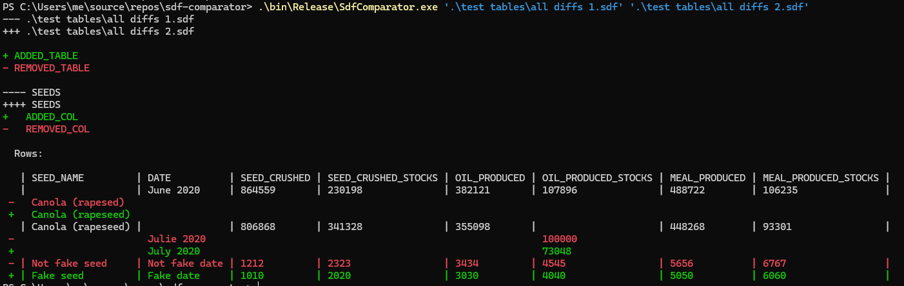

SDF comparator
--------------

A utility to compare SDF (SQL CE) database files

# Setup

* Install SQL CE Server 3.5 SP2 from https://www.microsoft.com/en-us/download/details.aspx?id=5783 (32 bits first, then 64 bits)
* Once that is installed (you'll need to reboot as instructed by the installer),
    open the solution in Visual Studio and add a reference from a DLL.
    Choose one of the System.Data.SqlServerCe.dll installed by the above. The project should then compile
